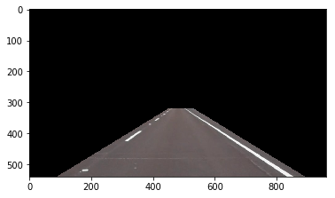
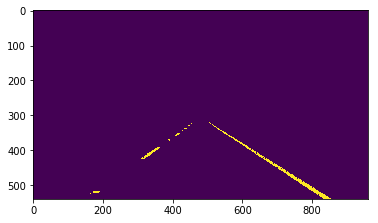
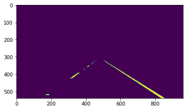
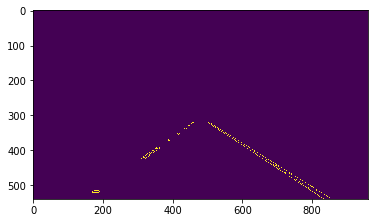
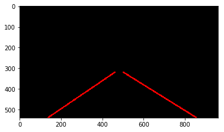
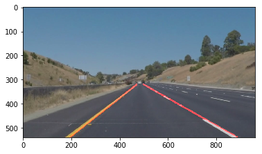

# Project 1 Writeup

By Alan Gou

# Part 1 — How my pipeline works

My final pipeline consisted of the following steps for processing a given image:

1. Convert image to grayscale
2. Color select for colors within a particular threshold
3. Run region of interest on the image
4. Run Gaussian blur on the image
5. Run Canny edge detection on the image
6. Run the Hough transformation line detection and draw lines on the image
7. Add overlay image to the original image to get the original image with red lines

## Creating the overlaid image

**Step 1. Region of interest selection**



**Steps 2 and 3. Grayscaling & color select**



**Step 4. Gaussian blur**



**Step 5. Canny edge detection**



**Step 6. Hough lines & draw lines**



**Step 7. Overlay lines onto original**



## Drawing the lines

Canny edge detection gives us a lot of lines, but we need to turn them into two discrete, solid lines. The steps are:

1. Categorize lines into two groups — negatively-sloped and positively-sloped
2. Turning all lines in each group into a single partial line
3. Extend each line to the top and bottom of the region of interest, or some other arbitrary min/max height

After that, you use `cv2.line()` to draw the lines on top of whatever mask image you're using.

### Step 1. Categorizing lines into groups

The equation for the slope is:

$$m = (y_2-y_1)/(x_2-x_1)$$

So it's simple to add lines to the negative-sloped group or the positive-sloped group.

```python
positive_sloped_lines = []
negative_sloped_lines = []
for line in lines:
    for x1,y1,x2,y2 in line:
        slope = (y2 - y1)/(x2 - x1)
        line = ((x1, y1), (x2, y2))
        if slope <= 0:
            negative_sloped_lines.append(line)
        else:
            positive_sloped_lines.append(line)
```

### Step 2. Averaging lines in each group into a single line

A line is two points. I guess I took the lazy way out and didn't actually take the average value of each line in each group, but instead took the leftmost point and rightmost point and created a line out of them.

You find the leftmost point by getting the point in all the lines with the lowest **x** value.

You find the rightmost point by finding the point with the highest **x** value.

And you create the new line by just returning the leftmost point and the rightmost point.

```python
    def average_lines(lines):
        leftmost_point = (100000, 0)
        rightmost_point = (0, 0)
        for p1, p2 in lines:
            if p1[0] < leftmost_point[0]:
                leftmost_point = p1
            if p2[0] < leftmost_point[0]:
                leftmost_point = p2
            if p1[0] > rightmost_point[0]:
                rightmost_point = p1
            if p2[0] > rightmost_point[0]:
                rightmost_point = p2
        return (leftmost_point, rightmost_point)
```

### Step 3. Extend each line to the top and bottom of the region of interest

A line in a coordinate plane is defined entirely by an equation of the form

$$y = mx+b$$

Given two points, you can find this equation with the following definitions:

$$m = (y_2-y_1)/(x_2-x_1)$$

$$b=y_1-mx_1$$

With that equation, you can then find the bottom-most point of the extended line, as well as the top-most point of the extended line, by simply plugging in the bottom **y-value** and top **y-value** you want.

```python
    def extend_line(line, y_min, y_max):
        ((x1, y1), (x2, y2)) = line
        m = (y2 - y1)/(x2 - x1)
        b = y1 - m*x1
        x_min = math.floor((y_min-b)/m)
        x_max = math.floor((y_max-b)/m)
        return ((x_min, y_min), (x_max, y_max))
```

# Part 2 — Shortcomings

There are two shortcomings with this method so far:

1. The drawn lines are very shaky — in the example video, the lines drawn are much smoother
2. Errors get thrown for vertical or near-vertical lines when extending them, because we get a divide by zero error

# Part 3 — Improvements

We can improve on the two shortcomings just mentioned.

### Part 1. Improving our line averaging method

The current method simply finds the leftmost point and rightmost point of all lines with a certain orientation, and returns that as the "averaged" line.

This makes the drawn lines very shaky, since the value of the leftmost and rightmost points can shift dramatically, and sometimes you see flickers where the line goes haywire in the video and crosses horizontally or in some other weird direction.

**Defining what an average of lines looks like**

We must define what an "average of lines" looks like ourselves. So this is our definition, for a given set of lines:

1. Sort the two points in each line so that the leftmost line — lowest **x-value** — comes first in each tuple
2. Extend each line using our method for extending lines to the top/bottom
3. Now, the first point in each line ought to have the same **y-value**, which is the bottom of the region of interest
   1. Likewise with the second point in each line, whose **y-values** ought to be the top of the region of interest
4. Average the **x-values** of the first points in each line — this forms the leftmost point of the resulting averaged line
5. Average the **x-values** of the second points in each line — this forms the rightmost point of the resulting averaged line

With this, you get a line that is the "average". Though, of course, this breaks down for lines that have slopes of 0, since we haven't handled extending lines with slopes of 0 yet. Though, once that works, this shouldn't be a problem.

### Part 2. Handling lines with slopes of 0

If we encounter a line with a slope of zero, then the points in that line have the same **y-value**. We can just draw a line from the leftmost side of the image to the rightmost side. If we want, we could also make this conform to the region of interest, so we don't go beyond the region of interest.